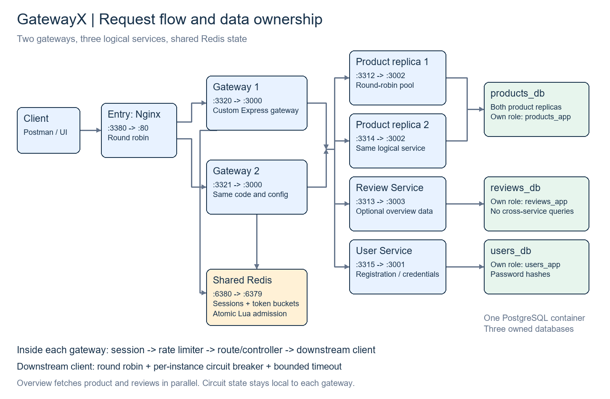
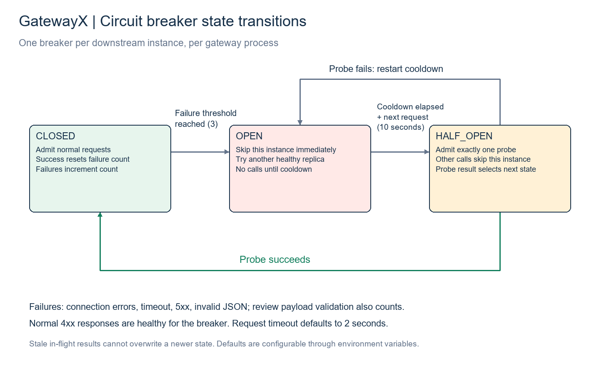

# GatewayX — Project Guide

A custom JavaScript API gateway built with Node.js and Express. It demonstrates
how to route, balance, limit, aggregate, and recover API calls across independent
services. PostgreSQL + Prisma replace the original assignment's MongoDB stack.

The local deployment runs two gateways, two Product Service replicas, User
Service, Review Service, Redis, PostgreSQL, and an Nginx entry load balancer.
Nginx only distributes traffic between gateway processes. API routing, rate
limiting, sessions, aggregation, and circuit breakers are implemented in Node.



## Run locally

Prerequisites: Node.js 22.14+ in the Node 22 line, npm, and Docker Desktop running
Linux containers with Docker Compose. Commands below run from the repository
root. The implementation was tested on Windows PowerShell.

### 1. Create configuration

```powershell
node scripts/setup-local.mjs
```

This copies sanitized examples into ignored environment files, generates a
session secret, and leaves existing files untouched. It also creates host-side
configuration for host-side demos. Both Docker gateways use the same `gateway/.env.docker`.
If you already have PostgreSQL data, the credentials in these files must match
that installation. Default service credentials are local demo values in
`infrastructure/postgres/init.sql`.

### 2. Start infrastructure and build the application images

```powershell
docker compose up -d --wait postgres redis
docker compose --profile apps build product-service review-service user-service gateway-1
```

PostgreSQL initialization creates three databases with separate owners. Its init
script runs only when the data volume is empty. Redis uses AOF persistence and
a named volume. No database data needs to be deleted to restart this project.

### 3. Apply migrations and seed products/reviews

```powershell
docker compose --profile apps run --rm user-service npx prisma migrate deploy
docker compose --profile apps run --rm product-service npx prisma migrate deploy
docker compose --profile apps run --rm review-service npx prisma migrate deploy
docker compose --profile apps run --rm product-service npm run seed
docker compose --profile apps run --rm review-service npm run seed
```

Run migrations once per logical service database. Product replicas share
`products_db`. `migrate deploy` does not use a shadow database. The shadow URLs in
the examples are configuration placeholders; creating migrations with
`migrate dev` requires separately provisioning those shadow databases.

### 4. Start the complete application

```powershell
docker compose --profile apps up -d --wait entry
docker compose --profile apps ps
```

Open [products](http://localhost:3380/api/products) or the
[product overview](http://localhost:3380/api/products/11111111-1111-4111-8111-111111111111/overview).

| Component | Host URL / port | Container port |
| --- | --- | --- |
| Main entry | http://localhost:3380 | 80 |
| Gateway 1 / 2 diagnostics | http://localhost:3320 / http://localhost:3321 | 3000 |
| Product replica 1 / 2 | http://localhost:3312 / http://localhost:3314 | 3002 |
| Review Service | http://localhost:3313 | 3003 |
| User Service | http://localhost:3315 | 3001 |
| PostgreSQL | 5432 by default | 5432 |
| Redis | 6380 by default | 6379 |

All published ports bind to localhost. Within Docker, services use Compose names
such as `redis:6379`, not host ports or localhost. Port 3380 avoids this machine's
blocked port 8080. If a port is occupied, edit its host mapping; changing a
container port also requires updating downstream configuration. The ingress
network uses `172.30.88.0/24`; its proxy address and trusted address must match if
you change the subnet.

## Public APIs

Use the base URL `http://localhost:3380`.

| Method | Path | Purpose |
| --- | --- | --- |
| GET | `/health` | Gateway liveness |
| GET | `/api/products` | Product list |
| GET | `/api/products/:id` | Product detail |
| GET | `/api/products/:id/overview` | Product + reviews, fetched in parallel |
| POST | `/api/users` | Register `{name,email,password}` |
| POST | `/api/auth/login` | Login `{email,password}` and receive a session cookie |
| GET | `/api/auth/me` | Current user; requires session cookie |
| POST | `/api/auth/logout` | Destroy session; send JSON `{}`; returns 204 |
| GET | `/debug/circuits` | Per-instance state, development only |
| GET | `/entry-health` | Nginx liveness, entry URL only |

For manual API checks, use your HTTP client with its cookie jar enabled.
Direct backend routes are diagnostic/internal interfaces; `/auth/verify` on
User Service does not create a session. Product/review write APIs are not provided.

## How requests work

1. Nginx selects a gateway using round robin.
2. Express loads any session from Redis and determines the user/IP identity.
3. An atomic Redis Lua script refills and consumes the applicable token buckets.
4. Routes and controllers call service clients. The client selects a downstream
   instance, checks its circuit breaker, and bounds the HTTP call with a timeout.
5. The overview calls Product and Review Services with `Promise.all`. Product
   data is essential. Review failure returns HTTP 200 with `reviews: null` and
   a `REVIEWS_UNAVAILABLE` warning; it does not hide the product.

The MVC organization uses Prisma schemas as database models, route/controller
layers for HTTP, and service layers for business logic and downstream access.
API responses are JSON; there is no server-rendered view layer.

### Load balancing and state

Each gateway has its own round-robin pointer and per-instance circuit breakers.
Equal replicas and similar request costs make round robin simple to demonstrate;
it does not guarantee equal CPU utilization when request costs differ. All
session data and rate allowances are shared in Redis, so sticky sessions are
unnecessary and gateway restarts do not reset those states. Process-local
breaker/routing bookkeeping resets on restart.

Nginx overwrites forwarding headers. Gateways trust only Nginx's explicit address
`172.30.88.10`; direct callers cannot choose their rate identity with a forged
X-Forwarded-For. NAT clients still share an anonymous IP allowance.

### Hand-written circuit breakers



Defaults: three consecutive failures open the circuit; after ten seconds, the
next eligible request is a single half-open probe. A successful probe closes the
circuit; a failure restarts the cooldown. Old in-flight results cannot overwrite
newer states. The default downstream timeout is two seconds. Network errors,
timeouts, 5xx, and invalid JSON count as failures; normal 4xx do not. Reviews also
validate successful payloads before counting them as healthy.

Requests already sent to an unhealthy instance can fail before its breaker
opens. There is no automatic downstream retry. Open product circuits are skipped
in favor of a healthy replica; when all instances are unavailable, selection
fails immediately. Optional reviews degrade the overview instead.

### Custom token-bucket rate limiter

The limiter is hand-written Lua executed atomically in Redis. Redis TIME supplies
a common clock. Concurrent requests across both gateways cannot independently
spend the same token. Multi-bucket admission is all-or-nothing.

| Policy | Capacity | Refill |
| --- | --- | --- |
| Authenticated user ID | 10 tokens | 2 per second |
| Anonymous IP | 20 tokens | 1 per second |
| Additional registration/login IP bucket | 5 tokens | 0.1 per second |

Token buckets allow controlled bursts with bounded average rates. A fixed window
has boundary bursts; sliding logs store per-request history; a leaky-bucket queue
adds waiting rather than this project's immediate admission/rejection behavior.
These are token budgets, not exact rolling-window quotas.

Rejections return 429 and a rounded-up `Retry-After`. Each admitted API request
costs one token, including an aggregate call. Health/debug routes are exempt.
Redis failures fail closed with 503; there is no per-process fallback allowance.
Detailed limiter behavior and recorded results appear below.

### Sessions

`express-session` and `connect-redis` store minimal user identity in Redis. Login
rotates the session ID; logout deletes it. Cookies are HttpOnly and SameSite=Lax.
User Service hashes passwords with salted scrypt. Both gateways must share the
session secret, cookie name, Redis prefix, and rate-limit configuration.

## Live demonstration

Host-side dependencies and Prisma Client for the live demos:

```powershell
npm ci
npm exec --workspace=user-service -- prisma generate
```

Automated unit/integration suites and smoke-test scripts have been removed at
the project owner's request. Earlier verification results are retained as
historical evidence in the docs. The live demos below remain available.

Run these live demos individually with the full Docker stack up:

```powershell
node --env-file=services/user-service/.env scripts/docker-load-balancing-demo.mjs
node scripts/docker-review-outage-demo.mjs
```

They demonstrate product-instance failure, gateway failure with a shared
session, review degradation, and automatic recovery. Each restores containers it stops; account-based demos remove their
temporary users and session keys. Normal rate limits apply, so allow buckets to
refill between repeated runs. Avoid unrelated traffic during call-count checks.

For a live review, show both circuit dashboards, stop a product replica, make
requests until each breaker opens, then restart it and demonstrate recovery:

```powershell
docker compose stop product-service-2
# Send requests through both gateways; inspect /debug/circuits on 3320 and 3321.
docker compose logs --tail 100 gateway-1 gateway-2
docker compose --profile apps up -d --wait product-service-2
# After cooldown, make requests again to trigger half-open probes.
```

Recorded demonstration results appear below. The assignment still requires
presenting the outage behavior live to the reviewer.

## Layout and diagrams

```text
gateway/src/                 # MVC HTTP layer and custom gateway policies
  routes/ controllers/ services/
  circuit-breaker/ downstream/ load-balancer/
  rate-limiter/ session/ middleware/
services/                    # User, Product, Review; own Prisma schemas/migrations
infrastructure/              # PostgreSQL initialization and Nginx config
scripts/                     # Setup, reproducible demos, diagram generation
docs/                        # This guide and two PNG diagrams
docker-compose.yaml
```

The architecture and circuit-state diagrams are included as PNGs in this folder.
`scripts/draw-diagrams.py` regenerates them using Python + Pillow; it is not
needed to run the application.

## Scope and remaining submission work

This is a local HTTP learning deployment. Compose sets development mode for
HTTP cookies and circuit diagnostics. Production requires HTTPS, production
cookie settings, secret management, and access restrictions. Nginx, Redis and
PostgreSQL each have one instance here; their high availability is not tested.
The Lua script targets standalone Redis, not arbitrary Redis Cluster slots.
Rate limiting is not an in-flight concurrency cap or a queue. RabbitMQ is not
needed for this synchronous assignment and is not included.

The database technology intentionally differs from the assignment: PostgreSQL
with Prisma replaces MongoDB/Mongoose. Confirm that substitution with the
reviewer. Bonus logging covers downstream attempts and latency; it is not a full
centralized tracing system. Health endpoints report liveness, not full readiness.

Repository: https://github.com/inductionotg/GatewayX. Environment secrets,
node_modules, generated Prisma clients, and personal API-client artifacts are
excluded from version control.

To stop without deleting data: `docker compose --profile apps stop`.
`docker compose down -v` deletes the database and Redis volumes; it is not a
normal restart command.

## Configuration reference

Set Docker gateway values in `gateway/.env.docker`. Both gateways load the same
file. Compose supplies the explicit trusted proxy address separately. Recreate
gateways with `docker compose --profile apps up -d --wait gateway-1 gateway-2`
after changing their environment file; a simple container restart does not load
new Compose environment values.

| Setting | Docker value / default | Purpose |
| --- | --- | --- |
| PORT | 3000 | Internal gateway port |
| PRODUCT_SERVICE_URLS | http://product-service:3002,http://product-service-2:3002 | Round-robin product pool |
| REVIEW_SERVICE_URL | http://review-service:3003 | Review dependency |
| USER_SERVICE_URLS | http://user-service:3001 | Credential/registration dependency |
| REDIS_URL | redis://redis:6379 | Shared state store |
| CIRCUIT_FAILURE_THRESHOLD | 3 | Consecutive failures before opening |
| CIRCUIT_RESET_TIMEOUT_MS | 10000 | Cooldown before a request can probe |
| DOWNSTREAM_TIMEOUT_MS | 2000 | Bound for each downstream call |
| SESSION_SECRET | Generated by setup | Same signing secret on both gateways |
| SESSION_COOKIE_NAME | gatewayx.docker.sid | Separate from host Node sessions |
| SESSION_TTL_SECONDS | 1800 | Session idle lifetime |
| SESSION_REDIS_PREFIX | gatewayx:docker:sessions: | Shared Docker session namespace |
| SESSION_REDIS_TIMEOUT_MS | 2000 | Bound for session store operations |
| RATE_LIMIT_PREFIX | gatewayx:docker:rate: | Shared Docker rate namespace |
| RATE_LIMIT_USER_CAPACITY / RATE_LIMIT_USER_REFILL_PER_SECOND | 10 / 2 | User policy |
| RATE_LIMIT_ANONYMOUS_CAPACITY / RATE_LIMIT_ANONYMOUS_REFILL_PER_SECOND | 20 / 1 | Anonymous IP policy |
| RATE_LIMIT_AUTH_CAPACITY / RATE_LIMIT_AUTH_REFILL_PER_SECOND | 5 / 0.1 | Additional auth IP policy |
| RATE_LIMIT_REDIS_TIMEOUT_MS | 2000 | Bound for limiter operations |
| TRUST_PROXY_ADDRESSES | 172.30.88.10, set by Compose | Explicit trusted entry proxy |
| TRUST_PROXY_HOPS | 0 | Default when no explicit trusted addresses are set |

## Rate-limit concurrency details

The Lua script calculates:

```text
tokens = min(capacity, previousTokens + elapsedSeconds * refillPerSecond)
```

Refill happens on demand using Redis TIME. One atomic execution evaluates all
applicable buckets and deducts a token from each only if all allow the request.
Rejected requests update refill state without consuming tokens. Each bucket has
two hash fields and expires only after enough idle time to refill completely.
Backward clock movement cannot create extra tokens. There are no refill timers
or read-modify-write races across gateway processes.

Identity comes from the verified session user ID or Express's client IP, never
from a caller-supplied user ID header. Multiple sessions for one user share the
same user allowance. Login and registration also use the stricter auth IP
bucket. Successful responses and 429s expose `X-RateLimit-Limit`,
`X-RateLimit-Remaining`, and `X-RateLimit-Policy`. `Retry-After` is rounded up from
the refill deficit; another concurrent request may spend that future token first.

The limiter runs after session loading and before controllers. Downstream
failures and unknown API routes still consume an admitted token. Malformed JSON
is rejected by the parser before limiting. Logout consumes a user token, so an
exhausted user must wait for refill before logging out. A timed-out Redis call
may still complete in Redis, conservatively consuming a token. Session failures
can return `SESSION_STORE_UNAVAILABLE`; limiter failures return
`RATE_LIMIT_STORE_UNAVAILABLE`. Neither silently falls back to process memory.

## Manual session walkthrough

Use the same hostname throughout and keep the HTTP client's cookie jar enabled.

1. POST `http://localhost:3320/api/users` with JSON:
   `{"name":"Demo User","email":"demo@example.com","password":"Demo-password-42"}`.
   Use a unique email when repeating registration; duplicates return 409.
2. POST `http://localhost:3320/api/auth/login` with that email and password.
   Save the returned `gatewayx.docker.sid` cookie.
3. Send that cookie to GET `http://localhost:3321/api/auth/me`. The same user
   should be returned even though a different gateway handles the request.
4. Run `docker compose restart gateway-1`, wait for its health endpoint, and
   send the cookie to GET `http://localhost:3320/api/auth/me`. Login survives.
5. POST `http://localhost:3321/api/auth/logout` with the cookie and JSON `{}`.
   Expect 204. The original cookie should now produce 401 on either gateway.

Cookies are shared across ports for the same hostname. Session IDs rotate at
login. Password hashes are not stored in sessions or returned from user APIs.
Authenticated sessions refresh their Redis TTL. Authentication writes require
JSON, and a supplied browser Origin must match the request origin.

## Independent-process session and load demos

The retained `scripts/session-live-demo.mjs` reads `gateway/.env` for host-side
Redis and downstream URLs, then starts its own two gateways on temporary ports.
For use with Docker backends, set that host-side file's `USER_SERVICE_URLS` to
`http://127.0.0.1:3315` and its Redis URL to the published Redis port. This file
is separate from the Docker gateways' configuration. Keep
`services/user-service/.env` pointed at the host PostgreSQL port for cleanup.

```powershell
node scripts/session-live-demo.mjs
node scripts/session-live-demo.mjs --rate-limit
```

The first command demonstrates shared login, process-restart persistence, and
cross-gateway logout. The second sends 200 concurrent authenticated requests
across two processes. It uses capacity 10 and a deliberately slow refill of
0.001 tokens/second so the short burst should admit 10 and reject 190 with 429.
It restarts one process and verifies the exhausted allowance remains exhausted.
These temporary policy overrides do not change the Docker defaults. Both demos
remove their own temporary users, Redis keys, and gateway processes.

## Recorded results and verification limits

| Demonstration | Observed result |
| --- | --- |
| Gateway/product routing | Both entry upstreams observed; each gateway called both product replicas |
| Product replica stopped | First 12 calls: six HTTP 200 and six bounded 504; both breakers opened after three failures |
| Product recovery | Both gateways logged OPEN -> HALF_OPEN -> CLOSED |
| Gateway stopped | Entry URL and existing session continued through the other gateway |
| Reviews stopped | Six overview requests remained HTTP 200 with product data and a reviews warning |
| Review circuit open | No further review calls; direct overview responses observed at 27 ms and 24 ms |
| Review recovery | Reviews returned without restarting gateways; both circuits closed |
| Independent-process rate burst | 200 requests, 10 admitted, 190 rejected; allowance stayed exhausted after restart |
| Proxy identity | Rotating forged forwarding headers did not bypass anonymous limits |
| Earlier automated verification | 29 checks passed before test suites were removed at the owner's request |

These are recorded local observations, not throughput guarantees. Automated test
suites and smoke scripts are not included. The live outage/demo scripts remain
available. Setup was checked in a temporary directory for valid generated
configuration and preservation of existing files. A complete fresh-volume Docker
installation was not repeated during documentation preparation.

## Troubleshooting and operations

- **Port already allocated:** stop your own conflicting process or choose another
  host port in Compose. Update host-side clients to match; internal service URLs
  continue to use container ports.
- **Could not parse JSON / upstream error:** check the configured service origin
  and route. An HTML 404 usually indicates an incorrect service URL or path.
- **429:** honor Retry-After. Repeated registration/login can exhaust the stricter
  auth bucket even if ordinary product requests still work.
- **Redis-related 503:** inspect Redis health and connection settings. Keeping
  health endpoints available does not mean session/rate storage is ready.
- **Missing tables:** run the checked-in deployment migrations. Starting a
  service does not automatically migrate its database.
- **Missing sample products/reviews:** run the seed commands in the setup steps.
- **Changed database credentials:** init.sql does not rerun on an existing volume;
  environment files must match its existing roles/passwords.
- **Review outage:** expect partial product overviews. Inspect `reviews` in each
  gateway's development circuit dashboard and make a request after cooldown to
  trigger recovery; there is no background probing loop.

```powershell
docker compose --profile apps ps
docker compose logs --tail 100 gateway-1 gateway-2
docker compose logs --tail 50 product-service product-service-2 review-service user-service
docker compose --profile apps stop
```
